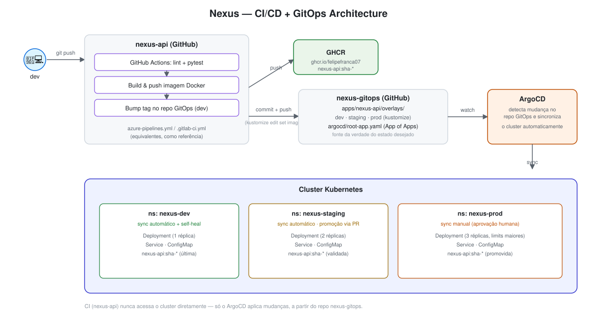

# Nexus GitOps

Repositório de configuração declarativa (padrão **GitOps**) para a
[`nexus-api`](https://github.com/FelipeFranca07/Nexus-Api), gerenciado
pelo **ArgoCD**. Este repositório é a fonte da verdade do estado desejado do
cluster — nenhum deploy é feito com `kubectl apply` manual.



## Estrutura

```
apps/nexus-api/
├── base/                 # Deployment, Service e ConfigMap "puros"
└── overlays/
    ├── dev/              # namespace nexus-dev · 1 réplica · atualizado automaticamente pelo CI
    ├── staging/          # namespace nexus-staging · 2 réplicas · promoção manual
    └── prod/             # namespace nexus-prod · 3 réplicas · limits maiores · promoção manual

argocd/
├── project.yaml                      # AppProject "nexus"
├── root-app.yaml                     # App of Apps — aponta para argocd/applications
└── applications/
    ├── nexus-api-dev.yaml         # sync automático (auto-sync + self-heal + prune)
    ├── nexus-api-staging.yaml     # sync automático
    └── nexus-api-prod.yaml        # sync manual (aprovação humana no ArgoCD)
```

## Padrão App of Apps

Em vez de registrar cada `Application` manualmente no ArgoCD, existe uma
única Application raiz (`argocd/root-app.yaml`) que aponta para a pasta
`argocd/applications/`. O ArgoCD sincroniza essa pasta e cria/gerencia as
três Applications (dev/staging/prod) automaticamente. Novos ambientes ou
novas apps só exigem um novo arquivo YAML nessa pasta.

## Fluxo de promoção

- **dev**: o pipeline de CI da `nexus-api` atualiza a tag da imagem no
  overlay `dev` a cada push no `main`. O ArgoCD sincroniza sozinho.
- **staging/prod**: promoção é manual — copia-se a tag validada em dev para
  o `kustomization.yaml` do overlay correspondente via PR. Staging sincroniza
  sozinho após o merge; prod exige clicar "Sync" no ArgoCD.

## Bootstrap em um cluster

```bash
# 1. Instalar o ArgoCD
kubectl create namespace argocd
kubectl apply -n argocd -f https://raw.githubusercontent.com/argoproj/argo-cd/stable/manifests/install.yaml

# 2. Criar o AppProject e a Application raiz (App of Apps)
kubectl apply -f argocd/project.yaml
kubectl apply -f argocd/root-app.yaml

# 3. Acompanhar
kubectl port-forward svc/argocd-server -n argocd 8080:443
argocd app list
```

A partir daí, o ArgoCD cria as três Applications filhas e sincroniza cada
overlay no seu respectivo namespace.

## Repositório da aplicação

Código-fonte, testes e pipeline de CI/CD ficam em
[`nexus-api`](https://github.com/FelipeFranca07/Nexus-Api).
